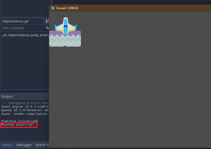
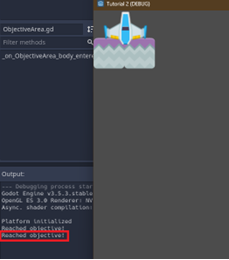
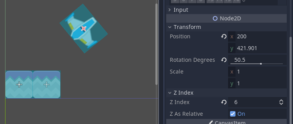

> Haikal Rahman - 200697891  
> Game Development  
> Tutorial 2  

# Latihan: Playtest
> Sekarang coba gerakkan objek landasan ke atas sehingga objek pesawatnya hampir menyentuh batas atas area permainan/window. Kemudian jawablah pertanyaan-pertanyaan berikut:

### Apa saja pesan log yang dicetak pada panel Output?
Pesan yang dicetak adalah “Reached objective!”. 

### Coba gerakkan landasan ke batas area bawah, lalu gerakkan kembali ke atas hingga hampir menyentuh batas atas. Apa saja pesan log yang dicetak pada panel Output?
Pesan yang sama dicetak, yaitu “Reached objective!”.	 

### Buka scene MainLevel dengan tampilan workspace 2D. Apakah lokasi scene ObjectiveArea memiliki kaitan dengan pesan log yang dicetak pada panel Output pada percobaan sebelumnya?
Ya. Tanpa melihat detail objek scene ObjectiveArea, posisi ObjectiveArea merupakan area yang jika disentuh oleh pesawat, akan menampilkan pesan tersebut ke layar. 

# Latihan: Memanipulasi Node dan Scene
> Sekarang coba kamu inspeksi scene-scene pada contoh proyek tutorial 2 dan jawablah pertanyaan-pertanyaan berikut:

### Scene BlueShip dan StonePlatform sama-sama memiliki sebuah child node bertipe Sprite. Apa fungsi dari node bertipe Sprite?	
Sprite merupakan node representasi visual dari scene BlueShip. Node ini memiliki attribute Texture (gambarnya), Offset, Animation, dan Region. 

### Root node dari scene BlueShip dan StonePlatform menggunakan tipe yang berbeda. BlueShip menggunakan tipe RigidBody2D, sedangkan StonePlatform menggunakan tipe StaticBody2D. Apa perbedaan dari masing-masing tipe node?	
RigidBody2D merupakan sebuah objek yang bergerak menggunakan simulasi fisik (misalnya gravitasi, atau dorongan objek lain). Dengan demikian, RigidBody2D memiliki atribut-atribut untuk mendukung tujuan tersebut, seperti massa, berat, skala gravitasi, dan lain sebagainya.
Sementara itu, StaticBody2D merupakan sebuah objek yang tidak bergerak berdasarkan objek lain. Objek ini hanya dapat digerakkan secara manual, seperti menggunakan kode. Atribut dari objek ini adalah Constant Linear Velocity dan Constant Angular Velocity yang memengaruhi pergerakan objek lain jika collide dengan objek ini.
 
### Ubah nilai atribut Mass dan Weight pada tipe RigidBody2D secara bebas di scene BlueShip, lalu coba jalankan scene MainLevel. Apa yang terjadi?		
Tidak terjadi perubahan sama sekali. Kecepatan objek ketika naik maupun turun tidak berbeda dengan yang sebelumnya.

### Ubah nilai atribut Disabled pada tipe CollisionShape2D di scene StonePlatform, lalu coba jalankan scene MainLevel. Apa yang terjadi?	
Pesan “Reached objective!” tidak tercetak ketika pesawat menyentuh CollisionShape2D.

### Pada scene MainLevel, coba manipulasi atribut Position, Rotation, dan Scale milik node BlueShip secara bebas. Apa yang terjadi pada visualisasi BlueShip di Viewport?
Perubahan nilai x dan y pada position mengubah posisi pesawat pada scene, perubahan Rotation Degrees mengubah orientasi pesawat, dan perubahan scale mengubah ukuran pesawat.

### Pada scene MainLevel, perhatikan nilai atribut Position node PlatformBlue, StonePlatform, dan StonePlatform2. Mengapa nilai Position node StonePlatform dan StonePlatform2 tidak sesuai dengan posisinya di dalam scene (menurut Inspector) namun visualisasinya berada di posisi yang tepat?	
Berdasarkan observasi, posisi StonePlatform dan StonePlatform2 adalah posisi relatif terhadap posisi parent Node keduanya, PlatformBlue. PlatformBlue memiliki posisi x sebesar 35, yang mana menggeser kedua platform ke kanan agar StonePlatform1 tidak terpotong setengah (karena posisi di sini merupakan posisi titik pusat). Sementara itu, posisi y dari PlatformBlue menentukan posisi vertikal awal ketika game dimulai. 	
Merujuk pada posisi tersebut, StonePlatform memiliki posisi relatif (x, y) sebesar (0, 0) yang mana merupakan posisi dari PlatformBlue. StonePlatform2, memiliki posisi relatif (x, y) sebesar (70, 0) sehingga memiliki offset horizontal sebesar 70 (ke kanan) dari titik pusat PlatformBlue, bertepatan tepat pada sebelah StonePlatform1 (tidak overlap, tidak memiliki celah).
